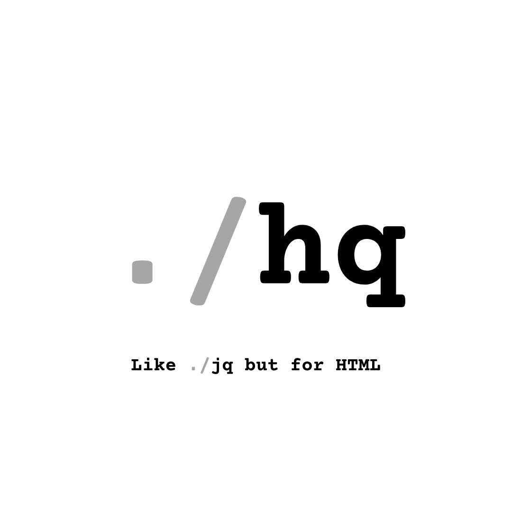

# hq (HTML Query)

**hq** is a lightweight command-line tool that parses HTML and extracts elements using CSS selectors. Inspired by tools like `jq` for JSON, **hq** makes it easy to extract content, attributes, and structure from HTML directly in your terminal.

It follows the Unix philosophy — use `curl` or other tools to fetch HTML, then pipe it into `hq` for querying.

---

## 📦 Features

- Accepts input from `stdin` or a file
- Supports standard CSS selectors (`div`, `a[href]`, `.class`, etc.)
- Extracts:
  - Full HTML nodes (outer HTML)
  - Inner HTML (`--inner`)
  - Text content (`--text`)
  - Specific attributes (`--attr href`, `--attr src`, etc.)
- Return first match only (`--first`) or all matches (default)
- Limit number of results (`--limit`)
- Output results in JSON format (`--json`)
- Resolve relative URLs using a base (`--base-url`)
- Designed to be simple, fast, and composable with Unix tools

---

## 🖥️ Usage Examples

```bash
# Extract the page title
curl http://example.com | hq "title"
# => <title>Example Domain</title>

# Get all image sources from a page
curl http://example.com | hq "img" --attr src
# => /images/logo.png
# => /images/banner.jpg

# Get just the first <h1>
cat page.html | hq "h1" --first
# => <h1>Welcome!</h1>

# Read from file instead of stdin
hq --file index.html "a.button" --attr href
# => /signup
# => /login

# Limit results and return in JSON format
hq -f index.html "a[href]" --attr href --json --limit 3
# => [
#      "/signup",
#      "/login",
#      "/forgot-password"
#    ]

# Resolve relative links using a base URL
hq -f index.html "a" --attr href --base-url https://example.com
# => https://example.com/about
# => https://example.com/contact
```

## 🛠 Installation
This tool is under active development.

To build from source:
```bash
git clone https://github.com/philpoore/hq.git
cd hq
make
sudo make install
```
Requirements:
- C++20 compiler
- CMake 3.10+
- Git
- curl (optional, for piping HTML in)

## 📚 Dependencies
This project uses a few excellent open-source libraries:

| Dependency | Purpose | Link
| ---------- | ------- | -------- |
| CLI11 | Command-line parsing (flags, options, args) | [Github](https://cliutils.github.io/CLI11) |
| Lexbor | Ultra-fast HTML parser and CSS selector engine | [Github](https://github.com/lexbor/lexbor) |
| nlohmann/json	| JSON output support (--json) | [Github](https://github.com/nlohmann/json)|


All dependencies are header-only or built directly via CMake. No external package manager required.

## ⚙️ CLI Options
```
Option	Description
--file FILE	Read HTML from a file instead of stdin
--attr ATTR	Return only the value of a specific attribute
--inner	Return only the innerHTML of matched nodes
--text	Return only text content of matched nodes
--first	Return only the first match
--limit N	Limit the number of matches returned
--json	Output results as a JSON array
--base-url URL	Resolve relative URLs using the provided base URL
```

## 🧪 Development Status
hq has a working MVP with all core features implemented. Contributions, feedback, and ideas are welcome!

## ✅ TODO: MVP Tasks
- [x] Accept HTML from stdin or file (--file)
- [x] Parse HTML using Lexbor
- [x] Support CSS selectors
- [x] Return full outer HTML
- [x] Add support for:
  - [x] --inner for innerHTML
  - [x] --attr for specific attributes
  - [x] --text for text content
  - [x] --first for first result only
  - [x] --limit to limit total results
  - [x] --json for JSON output
  - [x] --base-url to resolve relative links
- [x] Graceful error handling (missing selector, bad input, etc.)
- [x] CMake build + VSCode debugging setup

## ✨ Nice To Have (Future Ideas)
- [ ] Fetch URLs directly via --url (using libcurl)
- [ ] Pretty print / syntax-highlighted output
- [ ] Interactive REPL mode (hq -i)
- [ ] Selector benchmarking / profiling
- [ ] Output templates or formatting modes (e.g. CSV, XML, etc.)
- [ ] Regex filters on result text (--filter)
- [ ] Show node position / DOM tree path

## 🧠 Philosophy
Keep it small.
Keep it fast.
Do one thing well.

## 📄 License
MIT